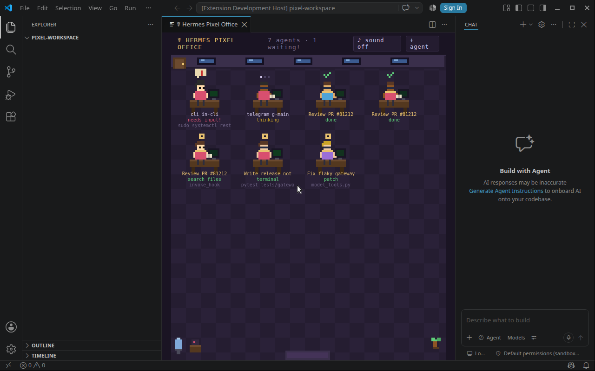

# Hermes Pixel Office ☤

A pixel-art virtual office for [Hermes Agent](https://github.com/NousResearch/hermes-agent) —
every agent session and every `delegate_task` subagent becomes an animated
pixel character at a desk. Watch tools fire, subagents spawn and finish,
approval requests flag you visually, and — with a GitHub login — compete on a
live leaderboard and chat with other offices, all in your browser or VS Code.

Hermes' answer to "Pixel Agents" for Claude Code.



Companion VS Code extension: [hermes-pixel-office-vscode](https://github.com/teknium1/hermes-pixel-office-vscode)
(this plugin works standalone in any browser — the extension is optional).

> **v0.3.0** adds the interactive office: a GitHub-username leaderboard, a
> 500-tier ladder, P2P office chat, and the full IdleViber icon set.
>
> **v0.4.0** adds editable user profiles + interface theming, tier gating
> (calls/sessions requirements, locked icon picker, unlock modal), real Hermes
> session counts from the state DB, and dark-background GitHub logo inversion.

## What you'll see

- One character per Hermes session (CLI, Telegram, Discord, cron, ...) —
  characters walk in through the door, sit at a desk, and walk out when the
  session ends
- Gold-collared characters are `delegate_task` subagents, labeled by goal
- Activity animations: typing (`write_file`/`patch`), reading a book
  (`read_file`/`search_files`), browsing (web tools), terminal work (green
  monitor flicker), delegating (pointing)
- Dangerous-command approvals: red "!" speech bubble + "needs input!" +
  header counter ("N waiting!")
- Header stats strip: live **Ops**, tool calls, sessions, and total time ran
- Optional sound: chime when an agent needs approval or a subagent finishes
  (♪ toggle in the header, off by default, persists)
- Sessions from ALL Hermes processes on the machine share one office

## The interactive office (v0.3.0)

Beyond the animated scene, the header now has **Leaderboard**, **Tiers**, and
**Chat** buttons that open scrollable panels.

### 🏆 Leaderboard — GitHub usernames only

- Ranks users by cumulative **Ops** (currency earned per tool call).
- **Only GitHub usernames ever appear** — agents, subagents, and non-logged-in
  "local" rows are never shown. Connect a GitHub identity (⚙ in the header)
  and your real username + avatar take the place of a generic row.
- Rows show rank, tier icon, name (DEV badge for the owner), tool calls, time
  ran, and Ops with their current tier.
- Click a row for a full profile card (Ops, calls, sessions, time, agents).

### 🪜 Tiers — all 500 IdleViber icons

- A 500-rung ladder, one rung per tier icon (the full 001–500 IdleViber set).
- Thresholds are cumulative Ops on an exponential curve: tier 1 = 0,
  tier 24 ≈ 150, tier 100 ≈ 1.5k, tier 400 ≈ 690k, tier 500 = 5,000,000.
- Your current rung is highlighted and scrolled into view.

### 💬 Office Chat — P2P mesh

- Broadcast chat to every other office on your GitHub network in real time.
- Messages survive nobody being online (cached locally), with a gentle
  two-note "ding" toggle.

## How the leaderboard + chat work

Scores and chat flow **only over WebRTC data channels** between browsers.
GitHub is used purely to set your identity (username/avatar) and for the
signaling handshake (presence + SDP offer/answer via the local plugin server
and a GitHub gist), so peers can find each other. No score or chat message
ever touches GitHub once channels open. This works across machines on the same
LAN/network; behind strict CGNAT it may need a TURN server (the same
limitation as IdleViber's mesh).

Visual only: the plugin observes lifecycle hooks — it never blocks, vetoes,
or transforms anything, adds zero model-tool footprint, and does not touch
the prompt cache.

## Install

```bash
git clone https://github.com/teknium1/hermes-pixel-office ~/.hermes/plugins/pixel-office
hermes plugins enable pixel-office
```

Start a **new** Hermes session (plugins load at process start — an
already-running session won't pick it up), make the agent do anything, and
open:

    http://127.0.0.1:8113

Windows: same commands; the clone path is `%USERPROFILE%\.hermes\plugins\pixel-office`.

> Note: to get the full v0.3.0 interactive office, install from
> `DrGekoz/hermes-pixel-office-enhanced` (this repo) rather than the upstream
> clone command above until the changes are merged upstream.

## VS Code

Install the [companion extension](https://github.com/teknium1/hermes-pixel-office-vscode)
and run **Hermes: Open Pixel Office** from the command palette. Same office,
rendered in a panel, plus a "+ agent" button that opens a terminal running
`hermes`.

## Configuration (optional)

`~/.hermes/config.yaml`:

```yaml
plugins:
  enabled:
    - pixel-office
  entries:
    pixel-office:
      port: 8113        # change if something else owns 8113
```

If you change the port, point the extension setting
`hermesPixelOffice.stateUrl` at the same port.

## Try it without any agents

```bash
python3 demo_feed.py
```

Fires synthetic sessions/subagents/approvals through the real plugin code
and serves the office — no Hermes install required (stdlib only).

## How it works

```
agents ──lifecycle hooks──▶ events.jsonl ──fold──▶ /state ──poll──▶ canvas office
```

Hook callbacks (`pre/post_tool_call`, `subagent_start/stop`,
`on_session_start/end`, `pre_approval_request`/`post_approval_response`)
append one JSON line each to `~/.hermes/pixel-office/events.jsonl` — O(1),
fail-open, microseconds. A daemon thread serves `web/index.html` (single
canvas page, sprites drawn in code, zero dependencies) and `/state`, which
folds the log into the current office snapshot. The log auto-trims at 512 KB.

The frontend is a dependency-free single page: `web/index.html` + `web/p2p.js`
(WebRTC mesh) + `web/tiers.js` (the 500-rung ladder, all icons in `web/icons/`).

## Troubleshooting

- **"office unreachable" in the browser/extension** — check
  `hermes logs --level warning`. The plugin logs loudly when it can't bind
  its port, including a probe verdict telling you whether the squatter is
  another (healthy) office, a foreign app, or a dead listener such as a
  stale VS Code port-forward.
- **`curl http://127.0.0.1:8113/state` hangs instead of refusing** — a
  system proxy or a ghost VS Code port-forward is intercepting localhost.
  Try `curl --noproxy "*" ...`; check VS Code's Ports view and stop stale
  forwards (they can outlive the remote server they pointed at).
- **Plugin enabled but nothing happens** — plugins load at process start.
  Exit and relaunch `hermes`; `/new` inside an old process is not enough.
  Verify with `hermes logs --level info | grep pixel-office` (Windows:
  `findstr /i pixel-office`) — you should see "registered" at session start.
- **Panels open off-screen or don't scroll** — ensure your webview reports a
  correct viewport height; the office area is height-constrained to fit.
- **No `events.jsonl` appearing** — the same log now carries a WARNING line
  naming the exact exception if event writes fail.

## License

MIT
