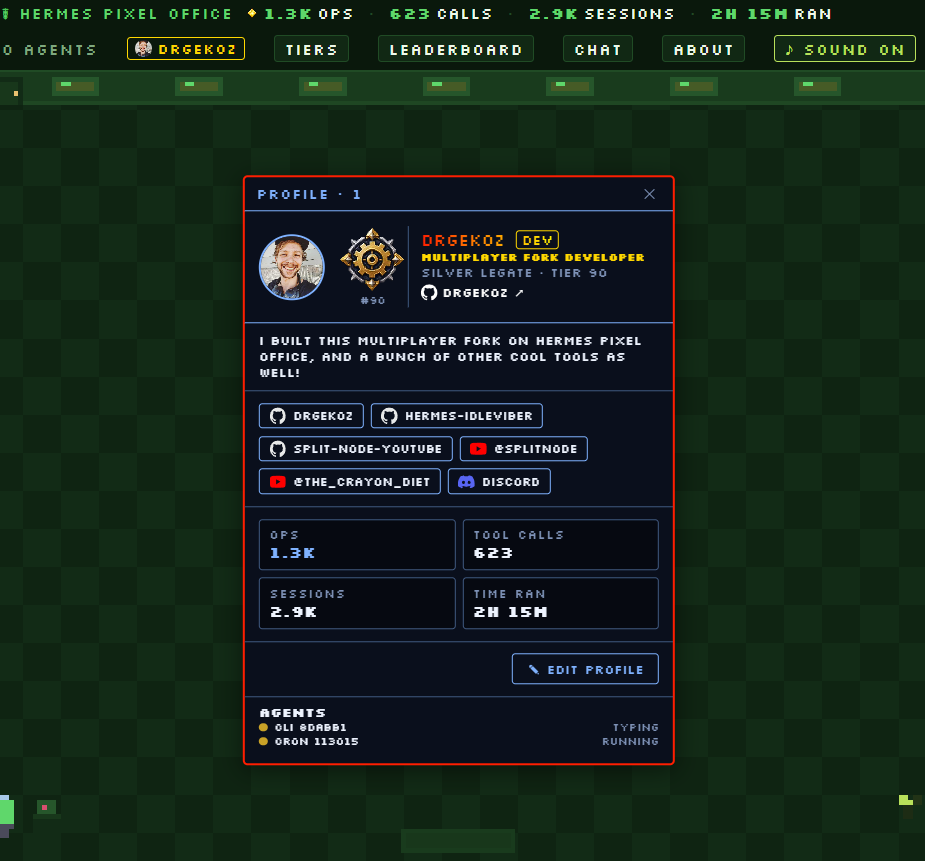
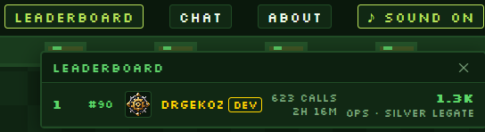
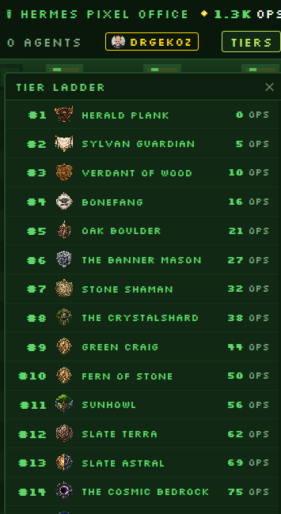
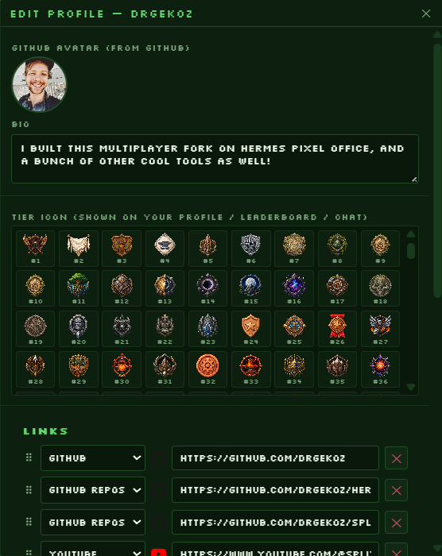
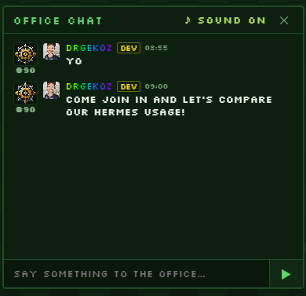
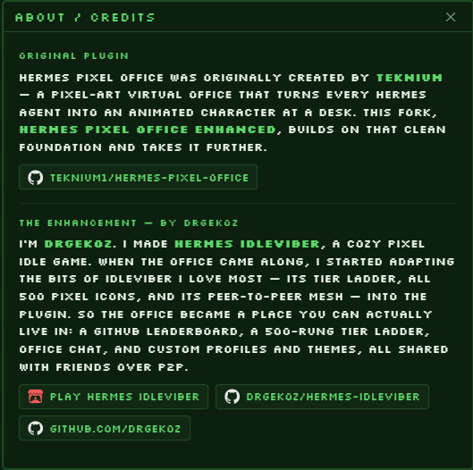

# Hermes Pixel Office Enhanced ☤

A pixel-art virtual office for [Hermes Agent](https://github.com/NousResearch/hermes-agent) —
every agent session and every `delegate_task` subagent becomes an animated
pixel character at a desk. Watch tools fire, subagents spawn and finish,
approval requests flag you visually, and — with a GitHub login — compete on a
live leaderboard, climb a 500-rung tier ladder, chat with other offices, and
style your own profile, all in your browser or VS Code.

Hermes' answer to "Pixel Agents" for Claude Code.

> This is the **enhanced** fork (by DrGekoz) built on top of Teknium's original
> plugin. It adds the full interactive office: a GitHub leaderboard, a 500-tier
> ladder, P2P office chat, editable profiles, a deep theming system, tier
> gating, and much more.



---

## The interactive office (v0.4.0)

Beyond the animated scene, the header has **Leaderboard**, **Tiers**, **Models**,
**Chat** and **About** buttons that open scrollable panels. Click any user to
open their profile; click **Edit Profile** to make it your own.

### 🏆 Leaderboard — GitHub usernames only



- Ranks users by cumulative **Ops** (currency earned per tool call).
- **Only GitHub usernames ever appear** — agents, subagents, and non-logged-in
  "local" rows are never shown. Connect a GitHub identity (⚙ in the header) and
  your real username + avatar take the place of a generic row.
- Rows show rank, tier icon, name (gold **DEV** badge for the owner), tool
  calls, sessions, time ran, and Ops with their current tier.
- Click a row for a full profile card.

### 🤖 Model Leaderboard — jekyll-hyde audit data

- Ranks **models** (not people) by how much **Jekyll-Hyde** has had to correct
  them. Sorted fewest-corrections first, so the most-corrected model sinks to
  the **bottom** of the board.
- **pixel-office supports the audit engine — it doesn't bundle it.** It reads
  whatever jekyll-hyde has written and never fabricates data. Each row shows
  more than a raw count: **corrections**, **sandbagged / genuine / uncertain**
  verdicts, **escalations**, and **last-corrected** time.
- If jekyll-hyde isn't installed, the panel shows a **"To contribute, download
  Jekyll-Hyde"** link straight to the plugin repo.
- The modelboard also **rides the P2P score packets**, so peers' audit data
  merges into one shared board across machines.
- View the same tally in-session with `/hyde corrections`.

### 🪜 Tiers — all 500 IdleViber icons



- A 500-rung ladder, one rung per tier icon (the full 001–500 IdleViber set).
- Thresholds are cumulative **Ops** on an exponential curve: tier 1 = 0,
  tier 24 ≈ 150, tier 100 ≈ 1.5k, tier 400 ≈ 690k, tier 500 = 5,000,000.
- **Tier gating (v0.4.0):** rungs also carry **calls** and **sessions**
  requirements alongside Ops. Locked tiers show a padlock; hovering a locked
  icon reveals what's still missing. Click an unlocked tier to set it as your
  displayed tier icon (picking a locked one opens the **Unlock Modal** instead).
- Your current rung is highlighted and scrolled into view.

### 👤 Profiles & themes (v0.4.0)



Every GitHub user can build a profile that travels with them across the office:

- **Bio** — a short description shown on your profile card.
- **Links** — an ordered, drag-and-drop list of social/repo links across
  platforms (GitHub, GitHub Repos, YouTube, Reddit, Spotify, SoundCloud,
  Discord, Steam). Your GitHub link is pre-filled automatically if you're
  logged in.
- **Profile theme** — a per-user accent colour + background applied to your
  profile popup when anyone views it. On dark profile backgrounds the GitHub
  logos auto-invert to white so they stay visible.
- **Interface theme** — a full office-wide colour theme you can customise.
- **DEV badge + rainbow theme** — the owner (`DrGekoz`), the original author
  (`teknium1`), and Jekyll-Hyde's creator (`jnorthrup`) get a gold **DEV**
  badge and an optional animated rainbow-border profile theme.

### 🎨 Theme engine (v0.4.0)

The office is fully themeable. Themes are built from palettes and applied
consistently to every surface:

- **10 colour series** (Scarlet, Ember, Sunflare, Emerald, Frost, Lagoon,
  Azure, Orchid, Neon, Amethyst) plus **12 multi-colour palettes** (Synthwave,
  Cyberpunk, Ocean, Forest, Candy, Sunset, Matrix, Midnight, Royal, Slate,
  Emberglow, Mint).
- Each surface is themed independently with its own preset dropdown: **main
  interface**, **leaderboard**, **chat**, **canvas** (floor/walls/windows/desks),
  **pixel agents** (shirt + hair colours), and **other**.
- Every section gets the generated colour series via `shadeHex()`/`buildTheme()`.
- Live preview while the Edit panel is open; ✕ reverts to your saved theme.

### 💬 Office Chat — P2P mesh



- Broadcast chat to every other office on your GitHub network in real time.
- Messages survive nobody being online (cached locally), with a gentle
  two-note "ding" toggle.

### ℹ️ About / Credits



The About panel credits the original plugin (by **Teknium**), the enhanced
fork (by **DrGekoz**), and **Jekyll-Hyde** (by **jnorthrup**), with links to
Hermes IdleViber, the pixel-office repos, and the jekyll-hyde repo.

---

## Credits

- **Teknium** — created the original **Hermes Pixel Office** plugin.
  ([teknium1/hermes-pixel-office](https://github.com/teknium1/hermes-pixel-office))
- **DrGekoz** — the **enhanced** fork: GitHub leaderboard, 500-tier ladder,
  P2P chat, profiles & theming, and the **Model Leaderboard** integration.
- **jnorthrup** (Jim Northrup) — creator of **Jekyll-Hyde**, the completion
  auditor the Model Leaderboard reads from. Jekyll-Hyde audits agent sessions
  off-stage every few turns with disposable clone reviewers, catches
  reward-hacking (performative compliance, quota-spreading, "let it lie"
  sloth), and drives verified next actions. pixel-office *supports* it — install
  it to contribute audit data to the Model Leaderboard.
  ([jnorthrup/hermes-jekyl-hyde](https://github.com/jnorthrup/hermes-jekyl-hyde))

All three are marked as **DEV** in the office.

---

## How the leaderboard + chat work

Scores and chat flow **only over WebRTC data channels** between browsers.
GitHub is used purely to set your identity (username/avatar) and for the
signaling handshake (presence + SDP offer/answer via the local plugin server
and a GitHub gist), so peers can find each other. No score or chat message
ever touches GitHub once channels open. This works across machines on the same
LAN/network; behind strict CGNAT it may need a TURN server (the same
limitation as IdleViber's mesh).

**Sessions** are reported from Hermes' real session store (`state.db`, cached
~20s) rather than only the events observed while the plugin was running, so
your session count matches what Hermes Desktop shows.

Visual only: the plugin observes lifecycle hooks — it never blocks, vetoes,
or transforms anything, adds zero model-tool footprint, and does not touch
the prompt cache.

## Install

```bash
git clone https://github.com/DrGekoz/hermes-pixel-office-enhanced ~/.hermes/plugins/pixel-office
hermes plugins enable pixel-office
```

Start a **new** Hermes session (plugins load at process start — an
already-running session won't pick it up), make the agent do anything, and
open:

    http://127.0.0.1:8113

Windows: same commands; the clone path is `%USERPROFILE%\.hermes\plugins\pixel-office`.

## VS Code

Install the [companion extension](https://github.com/teknium1/hermes-pixel-office-vscode)
and run **Hermes: Open Pixel Office** from the command palette. Same office,
rendered in a panel, plus a "+ agent" button that opens a terminal running
`hermes`.

## Configuration (optional)

`~/.hermes/config.yaml`:

```yaml
plugins:
  enabled:
    - pixel-office
  entries:
    pixel-office:
      port: 8113        # change if something else owns 8113
```

If you change the port, point the extension setting
`hermesPixelOffice.stateUrl` at the same port.

## Try it without any agents

```bash
python3 demo_feed.py
```

Fires synthetic sessions/subagents/approvals through the real plugin code
and serves the office — no Hermes install required (stdlib only).

## How it works

```
agents ──lifecycle hooks──▶ events.jsonl ──fold──▶ /state ──poll──▶ canvas office
```

Hook callbacks (`pre/post_tool_call`, `subagent_start/stop`,
`on_session_start/end`, `pre_approval_request`/`post_approval_response`)
append one JSON line each to `~/.hermes/pixel-office/events.jsonl` — O(1),
fail-open, microseconds. A daemon thread serves `web/index.html` (single
canvas page, sprites drawn in code, zero dependencies) and `/state`, which
folds the log into the current office snapshot. The log auto-trims at 512 KB;
events trimmed away are folded into a durable `ops_baseline.json` so
cumulative OPS/tools/sessions are never lost to the cap.

The frontend is a dependency-free single page: `web/index.html` + `web/p2p.js`
(WebRTC mesh) + `web/tiers.js` (the 500-rung ladder, all icons in `web/icons/`).

Frontend edits (index.html, tiers.js) are served fresh from disk — a
hard-refresh in the browser picks them up with no server restart. Backend
(`__init__.py`) changes require a Hermes restart.

## Troubleshooting

- **"office unreachable" in the browser/extension** — check
  `hermes logs --level warning`. The plugin logs loudly when it can't bind
  its port, including a probe verdict telling you whether the squatter is
  another (healthy) office, a foreign app, or a dead listener such as a
  stale VS Code port-forward.
- **`curl http://127.0.0.1:8113/state` hangs instead of refusing** — a
  system proxy or a ghost VS Code port-forward is intercepting localhost.
  Try `curl --noproxy "*" ...`; check VS Code's Ports view and stop stale
  forwards (they can outlive the remote server they pointed at).
- **Plugin enabled but nothing happens** — plugins load at process start.
  Exit and relaunch `hermes`; `/new` inside an old process is not enough.
  Verify with `hermes logs --level info | grep pixel-office` (Windows:
  `findstr /i pixel-office`) — you should see "registered" at session start.
- **Panels open off-screen or don't scroll** — ensure your webview reports a
  correct viewport height; the office area is height-constrained to fit.
- **No `events.jsonl` appearing** — the same log now carries a WARNING line
  naming the exact exception if event writes fail.

## License

MIT
